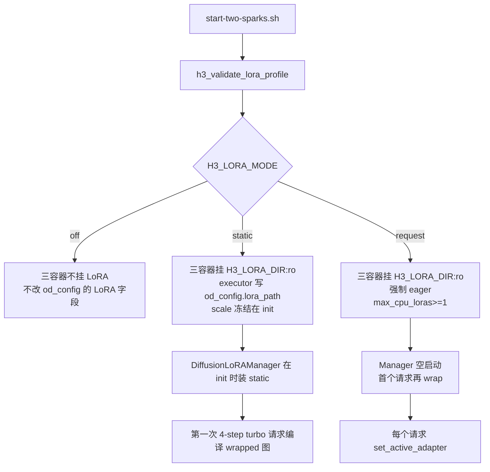
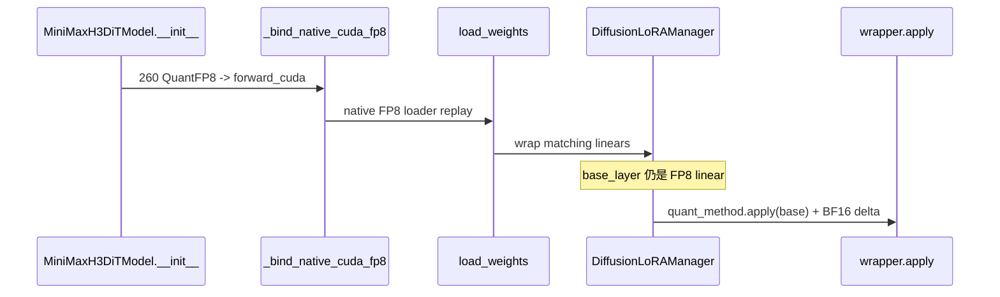
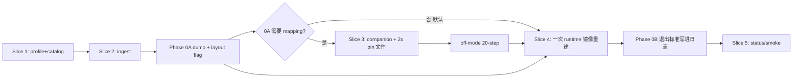

# MiniMax H3 双 Spark 部署：LoRA Adapter 服务端接入设计

| 项 | 值 |
|---|---|
| 文档标题 | Two-Spark MiniMax H3 FL2VA LoRA Serving |
| 作者 | Grok (design-doc-writer) |
| 日期 | 2026-08-20 |
| 状态 | Draft |
| 用户决策 | 2026-08-20 用户选定 v1 adapter = LightX2V FL2VA 4-step turbo（catalog `turbo4`，768p v1.0 优先） |
| 目标仓库 | `MiniMax-H3-2x-DGX-Spark/`（fork `Ajie16/MiniMax-H3-2x-DGX-Spark`） |
| 伴随仓库 | `MiniMax-H3-DGX-Spark/`（SM121 transformer 补丁；仅在 spike 证明需要 mapping 时改动） |
| 范围 | 已测双机 recipe 的 **serving-side LoRA 接入**；默认不在集群上训练 |

---

## Overview

双 Spark MiniMax H3 FL2VA 部署已经能以 Ulysses SP2 + 在线动态 FP8 + cuDNN attention + regional compile 稳定出片（warm T2VA 768x448 20-step 约 47.9 s，**不含 LoRA**）。用户现在要在这条已测路径上接入 LoRA，而不是重训或换 pin。

本设计把 LoRA 做成与 Cache-DiT 同级的 **fail-closed 运行档**：`H3_LORA_MODE=off|static|request`。默认 `off`，行为与今天完全一致。`static` 在进程启动时从本地 catalog 装一个 PEFT 目录，允许继续用 compile。`request` 允许按请求切换 catalog 内的名字，但在 compile+switch spike 通过之前强制 `H3_EXECUTION_MODE=eager`。适配器在集群外训练（fal / Inline Studio / musubi / diffusion-pipe / LightX2V distill），本仓库只负责：双机字节一致挂载、路径白名单、H3 fused QKV 键映射、FP8/compile 兼容性验证、以及 **4-step turbo** smoke。

Pinned 镜像 `vllm_omni==0.1.dev2381+g310b4b477` **已经有** `DiffusionLoRAManager`、Videos API 的 `lora` 字段、以及 worker 内 `set_active_adapter`。本 pin **没有** `--lora-backend distill`，也 **没有** `vllm serve --lora-path` CLI，**不得**为 distill fusion 升上游 digest。H3 transformer 的 `stacked_params_mapping` 为空。用户选定的 v1 adapter 是 LightX2V FL2VA **4-step turbo**（`lightx2v/Minimax-h3-Turbo` 的 ComfyUI 单文件，catalog `turbo4`），同样要先摄入成 PEFT 目录。`fal/MiniMax-H3-Realism-People-LoRA` 是可选的后续 style 条目，不是 v1。落地路径仍是：catalog + 摄入转换 + pin 原生 PEFT manager + 2x 挂载/预检。

---

## Background & Motivation

### 当前双机拓扑（role-flipped，保持不变）

| Role | Host | Fabric IP | Dist rank | 加载后内存（实测） |
|---|---|---:|---:|---:|
| API / rank 0（encoder、VAE、输出） | head / rank 0 | HEAD_IP | 0 | ~97 GiB used / ~24 GiB free |
| rank 1（DiT 一半） | peer / rank 1 | WORKER_IP | 1 | ~48 GiB used / ~72 GiB free |

- 控制面：Ray 2.56.1；数据面：PyTorch/NCCL over CX-7 200GbE RoCEv2（`enP2p1s0f0np0`，HCA `roceP2p1s0f0`，GID index 3）。
- 容器：`minimax-h3-2x-ray-head` + `minimax-h3-2x-api` 在 head，`minimax-h3-2x-ray-worker` 在 peer。
- **2026-08-20 已 `make down`**。上次 50-step 请求在 36/49 时 API segfault（exit 139）。LoRA 工作若需重启：**off-mode 基线仍用现有 20-step 768x448 smoke**；LoRA 验收用 **4-step turbo smoke**。不要用 50-step HQ。
- 镜像：`minimax-h3-2x-dgx-spark:experimental`（`sha256:81001bb2…`）双机一致。Base：`minimax-h3-dgx-spark:sm121-fp8`（本地重派生 `sha256:e498adce…`），上游 pin `vllm/vllm-omni:minimax-h3@sha256:e930db8e225162d01e17a49dddc43fd0e844208908d8356a028e5c4e7357696e`。
- API：`http://$HEAD_IP:8000/v1`，fabric 内无鉴权。不要对公网暴露。
- 当前三容器只挂 `$MODEL_DIR:ro` 与 `$HF_CACHE`。**LoRA 文件今天不存在于任何容器内。**

Ray 是控制面，`RayDiffusionExecutor.collective_rpc` 把同一个 `execute_model(req, od_config, …)` 广播到两个 actor；`unique_reply_rank=0, exec_all_ranks=True`。任一 rank 失败会把 executor 标死，没有单 rank 静默回退。这正是 LoRA 必须在 **两个 rank、同一请求对象、第一次 collective 之前** 激活同一 adapter 的原因。

### 痛点

1. 社区 H3 LoRA（ComfyUI / fal / musubi）已经能训、能在 ComfyUI 用，但 2x serving 路径没有挂载、没有 catalog、没有白名单。
2. 本 pin 的 H3 模块是 fused `attn.qkv_proj`（`QKVParallelLinear`）和 fused `mlp.fc1`（`MergedColumnParallelLinear`）。SM121 补丁把 **base checkpoint** 的 grouped QKV 行重排成 vLLM 的 Q-then-K-then-V。公开 adapter 的键是 ComfyUI fused `diffusion_model.blocks.N.attn.qkv_proj`。B 矩阵的 out 维在 grouped 与 Q-then-K-then-V 下 **同为 21504**，不能从 shape 判断。盲着重排会在两 rank 上同样搅乱 Q/K/V（Ulysses 仍对齐，片子「能出但风格错」）。ComfyUI / fal 加载器常常已经是 Q-then-K-then-V，因此 **默认不重排**，布局必须由摄入 flag 显式声明。
3. 在线 FP8 把 linear 包进 quantizer；LoRA wrapper 再包一层。顺序错了会拆掉 260 个 CUDA activation quantizer 绑定，或让 AdaLN 重新走进 FP8 激活陷阱。
4. 默认 `H3_EXECUTION_MODE=compile`。按请求换 adapter 会让 compiled graph 失效或算出错数。
5. API 无鉴权。客户端传入任意 `lora.path` 就是一次任意文件读取。

### 本 pin 里已经有的能力（不要再发明一套）

已在镜像 `minimax-h3-2x-dgx-spark:experimental` 核实：

| 组件 | 路径 | 行为 |
|---|---|---|
| Manager | `vllm_omni/diffusion/lora/manager.py`（733 行） | PEFT 目录、CPU LRU（`max_cpu_loras`，默认 1）、`set_active_adapter(LoRARequest, scale)`、从 `stacked_params_mapping` 推导 packed 映射 |
| Wrappers | `vllm_omni/diffusion/lora/layers/*` | `apply()` 先走 `base_layer.quant_method.apply`（保留 FP8），再以 matmul 加 LoRA delta |
| Worker | `DiffusionWorker.init_lora_manager` / `execute_model` | 每请求用 `req.sampling_params.lora_request` 激活；失败且 request 非空则 raise |
| Config | `OmniDiffusionConfig.lora_path / lora_scale / max_cpu_loras` | 字段存在；`max_cpu_loras` 默认 1 |
| HTTP | `VideoGenerationRequest.lora: dict \| None` | `{name\|lora_name\|adapter, path\|lora_path\|local_path, scale\|lora_scale, int_id\|lora_int_id}` |
| Parser | `parse_lora_request` | **同时要求 name 和 path**；`int_id` 缺省为 `stable_lora_int_id(path)` |
| Pipeline | `pipeline_minimax_h3.py:297` | `self.transformer = MiniMaxH3DiTModel(...)`，正好落在 manager 扫描的默认组件 `("transformer", "dit", …)` 里 |

本 pin **没有**：

- `--lora-backend distill` / `load_lora_weights` / LightX2V fuse-at-init（全树 0 文件）。
- `vllm_omni/entrypoints/cli/serve.py` 里的 `--lora-path` / `--lora-scale` / `--max-cpu-loras` CLI。`async_omni_engine.py` 虽能把 kwargs 里的 `lora_path` 写进 `engine_args`，但 serve CLI 根本没注册这些 flag。
- H3 transformer 上的任何 LoRA 代码：`stacked_params_mapping` 未定义，`packed_modules_mapping = {}`。

因此 **static 模式不能写 `--lora-path` 指望本 pin 认**。必须在 `RayDiffusionExecutor` 创建 actor 之前，把解析好的绝对路径写进 `od_config.lora_path`。

---

## Goals & Non-Goals

### Goals

1. 在 **不升 base-image digest** 的前提下，用 pin 内 `DiffusionLoRAManager` 服务 PEFT 格式 H3 adapter。
2. 三个 fail-closed 模式：`off`（默认，向后兼容）、`static`（启动时装一个，compile 允许）、`request`（按 catalog 名切换，v1 强制 eager）。
3. 双机同一绝对路径、同一字节；preflight SHA-256 对账，风格同 81/81 模型文件检查。
4. 客户端只许传 catalog `name`（`request` 模式可加 `scale`）。服务器解析路径。拒绝 `..`、绝对路径、客户端 `path`、catalog 外名字。`static` 下请求带 `scale` → 400。
5. 提供 ComfyUI 单文件 → PEFT 目录的摄入脚本。QKV 行布局由显式 `--qkv-layout=grouped|qkv|identity` 决定，**没有会改权重的默认值**；禁止用 `shape[0]==21504` 自动重排。
6. 验收：同 prompt/seed 的 768x448 T2VA。**off-mode 基线仍是 20-step**（现有 `smoke-t2va.sh`）。**LoRA static 验收是 4-step turbo**（`num_inference_steps=4`，catalog `recommended_flow_shift`）。SSIM/PSNR 只作 **change detector**，turbo **不是无损**；媒体必须完整 decode。
7. 日志能证明两个 rank 激活了同一个 `lora_int_id` / name。

### Non-Goals

1. **不在两台 Spark 上训练 LoRA**（第一期）。训练放在 fal / Inline Studio / musubi-tuner H3 fork / diffusion-pipe，训 FL2VA。
2. 不升 vLLM-Omni pin，不做 distill/LightX2V fuse-at-init。
3. 不把 turbo 4/8-step 或 Cache-DiT 说成无损。Turbo 是 **第一个实验室 serving 档**（仍近似、仍要 `H3_LORA_ALLOW_TURBO=true`），不是 lossless 替代 20-step 全计算。
4. 不服务 Ref2VA / I2V / 多 adapter GPU 常驻 / 并发 batch。范围仍是 **一条同步、batch-size-one 的 FL2VA 请求**。
5. 不交换 rank（保持 role-flip）。rank 0 已经 ~97/128 GiB，不把 encoder 挪到本机。
6. 不把 adapter 权重、生成媒体、`.env` 送进 git。
7. 不给 2x API 加公网暴露或鉴权改造（那是另一件事）。LoRA 路径白名单是在无鉴权前提下的最小补偿。
8. 不为「很多 adapter 同时 GPU 常驻」设计。`H3_MAX_CPU_LORAS` 默认 1。

---

## Key Decisions

| # | 决策 | 理由 |
|---|---|---|
| K1 | **Catalog + allowlist + 三模式**，默认 `off` | 与现有 `H3_CACHE_BACKEND` / `H3_EXECUTION_MODE` 同一套 fail-closed 风格；关闭时零挂载、零行为变化 |
| K2 | **不升 pin**；用 `g310b4b477` 的 `DiffusionLoRAManager` | 升 pin 要完整 2x 验收。本 pin 已有 PEFT manager 与 Videos `lora` 字段 |
| K3 | **static 通过改 `od_config.lora_path`，不走 CLI `--lora-path`** | 本 pin 的 `serve.py` 未注册该 flag。Executor 在 `ray.remote` 之前写入 `od_config`，随 actor 参数传到两 rank |
| K4 | **客户端只传 `name`；`request` 才允许 `scale`。服务端填 path** | `parse_lora_request` 要求 name+path。无鉴权 API 上客户端 path 是读原语。catalog 是唯一真相 |
| K5 | **static：省略 `lora` → 注入静态 adapter；其它名字或任何 `scale` → 400** | `set_active_adapter(None)` 会 **卸载** 已激活 adapter。`_activate_adapter` 把 scale bake 进 `lora_b * scale`；regional compile 是否快照这些 buffer 未测。v1 static **冻结启动时的 scale**；改 scale 请重启或用 `request`/eager |
| K6 | **`request` 模式 v1 强制 eager**（host launcher 看 `H3_EXECUTION_MODE`；进程内 **唯一** 真相是 `od_config.enforce_eager`） | regional compile + 换模块未测。今天 launcher 只把 host `H3_EXECUTION_MODE` 映射成 `vllm serve --enforce-eager`，**并不** `-e H3_EXECUTION_MODE`。serving 不得读该 env；与 executor 一样读 `od_config.enforce_eager`。手搓 `docker run` 若忘了 `--enforce-eager`，进程内仍会拒绝 |
| K7 | **摄入脚本是一等公民**；`--qkv-layout` **必填**，无改权重的默认 | v1 turbo 与可选 Realism 都是 ComfyUI/Diffusers **单文件**，不是 PEFT。grouped 与 Q-then-K-then-V 的 B 都是 21504 行，shape 不能当检测器。本 pin 无 distill fuse；禁止升 pin 走 `--lora-backend distill` |
| K8 | **默认跳过 companion mapping PR**。仅当 Phase 0A 证明必须 `stacked_params_mapping` 才改补丁 | 改 companion 会换 **本地** base image ID（不是上游 digest），2x `EXPECTED_BASE_IMAGE_ID` / Dockerfile ARG / `REPRODUCIBILITY.md` 必须一起改，并先跑 off-mode 20-step smoke |
| K9 | **LoRA A/B 保持 BF16，base 保持在线 FP8** | wrapper `apply()` 已是「FP8 base + 高精度 delta」。这是第一发货假设；spike 打脸则降到 eager 或拒绝发货 |
| K10 | **LoRA 与 Cache-DiT 互斥，看 effective backend** | `H3_CACHE_PROFILE` / `H3_CACHE_PROFILE_OVERRIDE=balanced` 会在 launcher 里把 backend 改成 `cache_dit`。mutex 必须在 remap **之后**，并把 `balanced` 视为 `cache_dit`，即使 `.env` 里 `H3_CACHE_BACKEND=none`。`start-two-sparks.sh` 与 `preflight.sh` 用同一函数 |
| K11 | **双机 bind-mount 同一绝对路径**，不做 API-only 挂载 | Ray actor 在 ray-head / ray-worker 里 load DiT，API 进程自己不 load adapter 权重 |
| K12 | **LoRA 验收 = 4-step turbo smoke；off-mode 基线 = 现有 20-step；仍禁止 50-step** | 上次 50-step 在 36/49 segfault。47.9 s 仍是无 LoRA 20-step 基线，不得改写成 turbo 结果。turbo 对 20-step 基线的 SSIM/PSNR 只作 change detector，**不是无损** |
| K13 | **保持 role-flip** | 本机工作节点是轻 rank 1。换 rank 需用户明确批准 |
| K14 | **训练不在本期** | 集群是 serving recipe。训练另开 phase，且要先证明 128 GB 统一内存 + FP8 补丁能跑通 trainer |
| K15 | **scale 优先级：请求 scale > 显式 `H3_LORA_SCALE` > catalog `default_scale` > `1.0`** | 必须区分「未设置」与「设成 1.0」。v1 static 没有「请求 scale」这一档（见 K5） |
| K16 | **v1 实验室档就是 turbo**；仍必须 `H3_LORA_ALLOW_TURBO=true` | 忘记开 flag 时 static turbo 不能启动。`smoke-t2va.sh`（20-step）不得被标成「turbo LoRA 能用」。turbo 请求若 `num_inference_steps != catalog.recommended_steps` → **400** |
| K17 | **v1 adapter = LightX2V FL2VA 4-step turbo（`turbo4`，768p v1.0 优先）**（用户已拍板） | 本集群 smoke 画布是 768-class。文件见 §2。禁止 `minimax_h3_ref2v_turbo_*`。8-step 不是 v1 默认。Realism People 可作后续 style 条目 |

**Measured (2026-08-22)：FP8-bake 路径已删除。** `wrap_diffusion_linear` 不再把
LoRA delta 烤进 per-tensor FP8 权重。实测 ref2v block-0 qkv/fc1 的 delta
absmean ~1e-5，而 per-tensor FP8 步长 ~3e-2，融合重量化后 delta 只剩
0.35–0.4%（相关性 ~0），等于 LoRA 失效；BF16 activation-add 保留 ~99.9%。
当前唯一路径是 K9 的「FP8 base + BF16 delta」，同时不再需要 ~20 GiB 的
FP8 snapshot/restore。

---

## Proposed Design

### 1. 运行档与环境变量

与 Cache-DiT 一样，全部由 `.env` + `start-two-sparks.sh` fail-closed 校验。

```bash
H3_LORA_MODE=off            # off | static | request   默认 off
H3_LORA_DIR=/absolute/path/on/both/hosts   # mode!=off 必填；走 h3_require_safe_value（空格等非法）
H3_LORA_CATALOG=            # 默认 $H3_LORA_DIR/catalog.json
H3_LORA_NAME=               # static 必填，必须是 catalog 键
H3_LORA_SCALE=              # 可选。未设置 ≠ 设成 1.0。见下方优先级
H3_MAX_CPU_LORAS=1
H3_LORA_ALLOW_TURBO=false   # 默认 false。实验室 v1 static turbo **必须** true；否则连 turbo4 都启不来
```

**Scale 解析（一处函数，validation / executor / `apply_request_lora` 共用）：**

```
resolved_scale =
    request.scale          if mode=request and the JSON contains scale|lora_scale
    else H3_LORA_SCALE     if the env var is set (including explicit 1.0)
    else catalog.default_scale if present
    else 1.0
```

实现上用 bash `[[ -v H3_LORA_SCALE ]]` / Python `"H3_LORA_SCALE" in os.environ`，不要 `os.environ.get("H3_LORA_SCALE") or default`（会把显式 `1.0` 与未设置搅在一起）。`static` 没有 request.scale 这一档。合法范围：`(0, 8]` 的 float。

本集群建议（写入本机 `.env`，**不要**写进仓库）：

```bash
H3_LORA_DIR=/absolute/path/on/both/hosts/loras
H3_LORA_MODE=static
H3_LORA_NAME=turbo4
H3_LORA_ALLOW_TURBO=true
# 省略 H3_LORA_SCALE → 用 catalog.default_scale（turbo4 为 1.0）
```

与 `MINIMAX_H3_MODEL_DIR` 相同策略：两台机器同一绝对路径。没有共享 NFS 时，adapter 目录必须像 FL2VA 一样 **拷过去再对哈希**。

**Effective cache backend**（mutex 用这个，不是裸 `H3_CACHE_BACKEND`）：

```bash
# 与 start-two-sparks.sh 里 balanced remap 同一规则，抽到 common.sh
h3_effective_cache_backend() {
  local profile="${H3_CACHE_PROFILE_OVERRIDE:-${H3_CACHE_PROFILE:-}}"
  if [[ "$profile" == balanced ]]; then
    echo cache_dit
  else
    echo "${H3_CACHE_BACKEND:-none}"
  fi
}
```

`scripts/start-cache-dit-profile.sh` 只 export `H3_CACHE_PROFILE_OVERRIDE=balanced` 再 `exec start-two-sparks.sh`。`preflight.sh` 自己 `source .env`，**看不到** launcher 里的 remap，除非它也调用 `h3_effective_cache_backend`。mutex 必须在 **remap 之后** 跑，并且 `start-two-sparks.sh` 与 `preflight.sh` 用同一函数。

校验规则（`h3_validate_lora_profile` in `scripts/common.sh`；launcher 在 balanced remap **之后**调用，preflight 对同一 effective 值再跑一遍）：

| 条件 | 动作 |
|---|---|
| `H3_LORA_MODE` 不是 `off\|static\|request` | `h3_fail` |
| `mode=off` | 忽略其余 LoRA 变量；不挂载 `H3_LORA_DIR`；**不**改 `od_config.lora_path` / `lora_scale` / `max_cpu_loras` |
| `mode!=off` 且 `H3_LORA_DIR` 空 / 非绝对路径 / 字符不在 `h3_require_safe_value` 字符集 | `h3_fail` |
| `mode!=off` 且 catalog 文件在 **任一** 主机上不存在或 JSON 非法 | `h3_fail`（`request` 与 `static` 都要 catalog） |
| `mode=static` 且 `H3_LORA_NAME` 空或不在 catalog | `h3_fail` |
| `mode=request` 且 `H3_EXECUTION_MODE!=eager` | `h3_fail`：`request mode requires H3_EXECUTION_MODE=eager until compile+switch is measured` |
| `mode!=off` 且 `h3_effective_cache_backend` ≠ `none`（含 `H3_CACHE_PROFILE=balanced` / `H3_CACHE_PROFILE_OVERRIDE=balanced`） | `h3_fail`：LoRA 与 Cache-DiT 互斥 |
| `H3_MAX_CPU_LORAS` 非 ≥1 的整数 | `h3_fail` |
| `H3_LORA_SCALE` **已设置** 但不是 `(0, 8]` 的 float | `h3_fail`（不要让 executor `float(...)` 甩栈） |
| catalog 条目 `profile=turbo` 且 `H3_LORA_ALLOW_TURBO!=true` | `h3_fail`（static 选中该名，或 catalog 里存在 turbo 且 mode=request 都算）。实验室 v1 **要** true 才能开 `turbo4` |
| `H3_LORA_ALLOW_TURBO` 不是 `true\|false` | `h3_fail` |
| `mode=static` 且选中 `profile=turbo`，但后续 smoke 仍发 20-step | 启动本身在 flag 正确时允许；**serving** 对 turbo 且 `num_inference_steps != recommended_steps` 返回 **400**（见 §5） |

### 2. Catalog 格式

文件：`$H3_LORA_DIR/catalog.json`（config，不是 secret）。仓库只放 `docs/lora-catalog.example.json`。

```json
{
  "version": 1,
  "license": "Adapters inherit the MiniMax H3 Community License, including territorial restrictions. See MODEL-LICENSE.md.",
  "adapters": {
    "turbo4": {
      "path": "turbo4/",
      "format": "peft",
      "profile": "turbo",
      "default_scale": 1.0,
      "recommended_steps": 4,
      "recommended_flow_shift": 6,
      "recommended_audio_flow_shift": 3,
      "sha256_manifest": "turbo4.sha256",
      "source": "lightx2v/Minimax-h3-Turbo",
      "source_file": "minimax_h3_fl2v_turbo_4step_v1.0_768p_comfyui_bf16.safetensors",
      "notes": "PEFT from ingest-lora.sh. FL2VA / T2VA only. Distilled NFE=4 at 768p 1344x768, video/audio shifts 6/3. Do not point at the raw ComfyUI/Diffusers safetensors. Do not use minimax_h3_ref2v_turbo_*."
    }
  }
}
```

可选后续 style 条目（**不是** v1，勿写入实验室 `.env` 的 `H3_LORA_NAME`）：

```json
"realism": {
  "path": "realism/",
  "format": "peft",
  "profile": "style",
  "default_scale": 1.0,
  "trigger": "r34l1sm",
  "recommended_steps": 20,
  "source": "fal/MiniMax-H3-Realism-People-LoRA"
}
```

字段约定：

| 字段 | 规则 |
|---|---|
| catalog 键 / `H3_LORA_NAME` | `^[a-z0-9._-]+$` |
| `path` | catalog 相对路径，必须是单层目录名 + 可选尾斜杠，例如 `turbo4/`。禁止 `..`、禁止绝对路径、禁止指向 `H3_LORA_DIR` 外 |
| `format` | v1 只接受 `peft` |
| `profile` | `style`（20-step 日程）或 `turbo`（改 `num_inference_steps`）。v1 实验室档是 `turbo`，仍必须 `H3_LORA_ALLOW_TURBO=true` |
| `default_scale` | turbo4 与 Realism 卡片都是 **1.0** |
| `recommended_steps` | turbo4 = **4**。`profile=turbo` 时请求的 `num_inference_steps` 必须等于此值，否则 serving **400** |
| `recommended_flow_shift` / `recommended_audio_flow_shift` | turbo4 v1.0 768p = **6 / 3**。`smoke-t2va-lora.sh` 必须用这两项，不要用 off-mode 的 `flow_shift=12` |
| `sha256_manifest` | 相对 `H3_LORA_DIR` 的清单文件，每行 `HASH  relpath`，覆盖该 adapter 目录下所有文件 |
| 解析后的绝对路径 | `realpath($H3_LORA_DIR)/<path>`，且 `realpath` 结果必须以 `realpath($H3_LORA_DIR)/` 为前缀 |

PEFT 目录最低文件集（preflight 检查）：

```text
$H3_LORA_DIR/turbo4/adapter_config.json
$H3_LORA_DIR/turbo4/adapter_model.safetensors   # 或 adapter_model.bin
$H3_LORA_DIR/turbo4.sha256
```

`adapter_config.json` 必须能被 `PEFTHelper.from_local_dir` 读出 `r`、`lora_alpha`、`target_modules`。v1 摄入脚本会写（`r` / `lora_alpha` / `target_modules` 以 turbo4 的 0A dump 为准，下面只是形状）：

```json
{
  "peft_type": "LORA",
  "r": 16,
  "lora_alpha": 16,
  "target_modules": ["qkv_proj"],
  "lora_dropout": 0.0,
  "bias": "none",
  "base_model_name_or_path": "MiniMax-H3/FL2VA"
}
```

`target_modules` 最终以 spike 对 **turbo4** 键的观察为准。

#### v1 实验室 catalog 身份（用户已拍板）

优先（本集群 smoke 是 768-class）：

| 项 | 值 |
|---|---|
| catalog 名 | `turbo4` |
| source | `lightx2v/Minimax-h3-Turbo` |
| ComfyUI 摄入源 | `minimax_h3_fl2v_turbo_4step_v1.0_768p_comfyui_bf16.safetensors` |
| Diffusers 孪生文件 | `minimax_h3_fl2v_turbo_4step_v1.0_768p_bf16.safetensors` |
| spec | FL2VA / T2VA；训在 768p 1344×768；video/audio shift **6 / 3**；蒸馏 NFE **4**；推荐推理 NFE **4**（ModelTC/Minimax-H3-Turbo） |
| `profile` | `turbo` |
| `default_scale` | `1.0` |
| `recommended_steps` | `4` |
| `recommended_flow_shift` / `recommended_audio_flow_shift` | `6` / `3` |
| 范围 | **只 FL2VA**。本 2x 服务不加载 Ref2VA。**禁止** `minimax_h3_ref2v_turbo_4step_*` |

本 pin **没有** `--lora-backend distill` / `load_lora_weights`。路径仍是：下载 ComfyUI 或 Diffusers **单文件** → `ingest-lora.sh --qkv-layout=…` → PEFT 目录 → `DiffusionLoRAManager`。**不要**为 distill fusion 升上游 digest。

**不要**把 8-step v1.0 当 v1 默认；可作后续 catalog 条目。

若 768p v1.0 摄入/加载在 Phase 0A 失败，回退 FL2VA Turbo 4-step **v0.1**：

- ComfyUI：`Kijai/MiniMax-H3_comfy` 的 `minimax_h3_fl2v_lightx2v_turbo_4step_v0.1_comfy.safetensors`
- 或 Diffusers：`minimax_h3_fl2v_turbo_4step_v0.1.safetensors`
- 训在 544p mixed AR，shift **12 / 3**，NFE 4。若走这条，catalog 的 `recommended_flow_shift` 改成 **12**，并在 `notes` 标明 v0.1。

**Wrap 计数（suffix `qkv_proj`）：** `DiffusionLoRAManager._match_target_modules` 是后缀匹配（`.*\.qkv_proj$`）。`MiniMaxH3TokenRefiner` 也用 `MiniMaxH3Attention.qkv_proj`（`token_refiner_num_layers=2`）。因此 `target_modules: ["qkv_proj"]` 会 wrap：

- 50 个主 `blocks.*.attn.qkv_proj`（turbo4 键以 0A dump 为准；可能同样是 fused QKV）
- 2 个 `token_refiner.blocks.*.attn.qkv_proj`（无匹配权重 → `reset_lora`，多两层 `apply()` 快路径）

Phase 0 期望 wrap 数是 **50 + 2 = 52**，不是 50。0A 若 `PEFTHelper` 接受更具体的 `blocks.*.attn.qkv_proj`（或等价列表）且能避免 refiner wrap，优先用那个；否则文档与 spike 都按 52 计。摄入 **拒绝** `target_modules` 含 AdaLN `linear`、`condition_proj`、以及 FP8 `ignored_layers`（`video_patch_proj` / `audio_patch_proj` / `time_embedder.proj_in` / `time_embedder.proj_out` / `final_layer.video_out` / `final_layer.audio_out`）。

### 3. 挂载与进程可见性

今天 `start-two-sparks.sh` 对三个容器的挂载是：

```text
ray-head:    $MODEL_DIR:ro  $HF_CACHE
ray-worker:  $MODEL_DIR:ro  $HF_CACHE
api:         $MODEL_DIR:ro  $HF_CACHE  $OUTPUT_DIR→/output
```

`mode!=off` 时，**三个容器都增加**：

```bash
-v "$H3_LORA_DIR":"$H3_LORA_DIR":ro
```

容器内路径 = 主机绝对路径（与 checkpoint 相同）。不要把 host 路径映射成 `/loras` 再在 catalog 里写另一套路径——那会让 preflight 与 actor 对不上。

Actor 环境：`h3_multinode/executor.py` 的 `env_keys` / `actor_env` 今天只转发 NCCL 与 `H3_HEAD_IP` 等。LoRA 键必须按 **现有** 模式追加——只转发 **已设置** 的变量：

```python
lora_env_keys = (
    "H3_LORA_MODE",
    "H3_LORA_DIR",
    "H3_LORA_CATALOG",
    "H3_LORA_NAME",
    "H3_LORA_SCALE",
    "H3_MAX_CPU_LORAS",
    "H3_LORA_ALLOW_TURBO",
)
actor_env.update({key: os.environ[key] for key in lora_env_keys if key in os.environ})
```

**禁止** `actor_env["H3_LORA_SCALE"] = os.environ.get("H3_LORA_SCALE", "")`：那会把「未设置」变成「设成空」，打穿 K15。

**Ray actor 的 env 来自 API 进程的 `runtime_env`，不是 ray-head / ray-worker 的 `docker -e`。** 只把 `H3_LORA_*` 放进 COMMON_ENV 不够：必须 **API `-e`（见启动器接口：仅 `[[ -v VAR ]]` 时才传）+ `actor_env` 条件转发**。集成检查：两 rank 日志的 `H3 LoRA rank=… mode=…` 必须同一 `mode=`（即使 `docker inspect minimax-h3-2x-ray-worker` 没有这些 `-e`）。

### 4. 三模式语义



#### `off`

- 不挂载、不导入 catalog。
- **不**改 `od_config.lora_path` / `lora_scale` / `max_cpu_loras`（保持 pin 默认：`lora_path=None`、`lora_scale=1.0`、`max_cpu_loras` 默认 1）。
- 客户端若带 `lora` 字段：API 返回 **400** `LoRA is disabled (H3_LORA_MODE=off)`。
- Worker 若仍收到 `lora_request`（防御）：raise，executor 标死该请求（已有政策）。

#### `static`（第一发货档）

启动路径（本 pin 无 CLI flag，必须走 executor）。**仅当 `H3_LORA_MODE=static`** 才写这些字段：

```python
# h3_multinode/executor.py  _init_executor()，创建 actor 之前
mode = os.environ.get("H3_LORA_MODE", "off")
if mode == "request" and not self.od_config.enforce_eager:
    raise RuntimeError("H3_LORA_MODE=request requires H3_EXECUTION_MODE=eager")
if mode == "off":
    pass  # 不碰 od_config LoRA 字段
elif mode == "static":
    resolved = resolve_catalog_entry(os.environ["H3_LORA_NAME"])
    self.od_config.lora_path = resolved.absolute_path
    self.od_config.lora_scale = resolved_scale(resolved, request_scale=None)
    self.od_config.max_cpu_loras = int(os.environ.get("H3_MAX_CPU_LORAS", "1"))
elif mode == "request":
    self.od_config.lora_path = None
    self.od_config.max_cpu_loras = int(os.environ.get("H3_MAX_CPU_LORAS", "1"))
```

`DiffusionWorker.init_lora_manager` 已有：

```python
DiffusionLoRAManager(..., lora_path=self.od_config.lora_path, lora_scale=self.od_config.lora_scale)
```

它会构造 `LoRARequest(lora_name="static", lora_int_id=stable_lora_int_id(path), lora_path=path)` 并 `set_active_adapter`。为了让日志与 catalog 名一致，executor 写入后、manager 初始化前，worker 包装层应把这次请求的 `lora_name` 改成 catalog 名。最小改法：在 `MultiNodeDiffusionWorker.init_lora_manager` 里先设 `od_config.lora_path`，再 `super()`，并在 manager 返回后 `pin_adapter`。

请求期：

| 客户端 `lora` | 行为 |
|---|---|
| 省略 | serving 层填入 static 的 name/path 与 **启动时冻结的 scale**，避免 `set_active_adapter(None)` 卸掉 adapter |
| `{"name":"<static name>"}`（无 scale） | 接受；scale 仍是启动值 |
| `{"name":"<static name>", "scale": s}` | **400** `static LoRA scale is frozen at init; restart or use H3_LORA_MODE=request` |
| `{"name":"other"}` | **400** `static LoRA is '<name>'; restart with H3_LORA_NAME=other to switch` |
| 带 `path` / `local_path` / `int_id` | **400** `client-supplied lora.path is not allowed` |

`static` + `compile` 允许：wrap 发生在 init，第一次请求才 compile，compiled 图含 LoRA 分支。不要在进程活着时换 adapter **或 scale**。

#### `request`（第二档，eager）

- 不设 `od_config.lora_path`。
- `od_config.max_cpu_loras = H3_MAX_CPU_LORAS`（默认 1）。
- 客户端：`lora={"name":"turbo4"}` 或 `{"name":"turbo4","scale":1.0}`（scale 走 K15 优先级）。turbo 且 `num_inference_steps != 4` → 400。
- 省略 `lora`：跑基座（`set_active_adapter(None)` 合法）。
- 名字不在 catalog / 带 path：400。
- 切换 adapter 会走 manager LRU；`max_cpu_loras=1` 时旧的被 evict。**不要**在 compile 档下做这件事。
- serving 与 executor 若发现 `mode=request` 且 `od_config.enforce_eager` 为假：分别 400 / `RuntimeError`（`H3_LORA_MODE=request requires H3_EXECUTION_MODE=eager`）。**不要**用 API 容器里的 `H3_EXECUTION_MODE` env 判断——launcher 今天不注入该变量。

### 5. Serving 层：补丁目标是 `_apply_lora`（已核实）

当前 `scripts/smoke-t2va.sh` 发 multipart 到 `POST /v1/videos/sync`。本 pin 的路径是：

```text
api_server.create_video_sync
  → _parse_video_form          # 把 lora 存成 dict，此处不调用 parse_lora_request
  → handler.generate_video_bytes
  → OmniOpenAIServingVideo._apply_lora
  → parse_lora_request         # 强制要 name + path
```

`api_server._parse_lora_request` 给 image / layered / chat 用，**不是** v1 smoke 路径。v1 补丁只改一处：

`vllm_omni/entrypoints/openai/serving_video.py::_apply_lora`

可选替代：包装 `parse_lora_request` 本身（一个函数，所有 caller 受益）。不要同时改两个 call site 来「对冲不确定」。不要只改 `_parse_lora_request` 而留下 `_apply_lora`。

保持 2x 仓库小：新增 `h3_multinode/lora_catalog.py`，再加一个与现有 Ray patch 同风格的窄补丁 `patches/enable-lora-catalog.patch`：

把 `_apply_lora` 从 `@staticmethod` 改成实例方法（调用点已是 `self._apply_lora(...)`），以便读 engine 的 diffusion `od_config`：

```python
from h3_multinode.lora_catalog import apply_request_lora
from vllm_omni.entrypoints.openai.utils import resolve_diffusion_od_config

def _apply_lora(self, lora_body, gen_params):
    od_config = resolve_diffusion_od_config(self._engine_client)
    enforce_eager = bool(getattr(od_config, "enforce_eager", False))
    try:
        lora_request, lora_scale = apply_request_lora(
            lora_body, enforce_eager=enforce_eager
        )
    except ValueError as e:
        raise HTTPException(status_code=400, detail=str(e)) from e
    if lora_request is None:
        return
    gen_params.lora_request = lora_request
    if lora_scale is not None:
        gen_params.lora_scale = lora_scale
    _enforce_turbo_schedule(gen_params)
```

`_enforce_turbo_schedule`（v1，`profile=turbo`）：

- 读 catalog 条目的 `recommended_steps`（turbo4 = 4）。
- 若 `gen_params.num_inference_steps is None`：写入 `recommended_steps`。
- 若已设置且 `!= recommended_steps`：**400** `turbo adapter requires num_inference_steps=<recommended_steps>`。这挡住 20-step+turbo 被叫作成功。
- `flow_shift`：smoke **必须**用 `recommended_flow_shift`（v1.0 768p = 6）。Phase 0B 若误用 12，记日志；v1 serving **不**因 shift 单独 400（只强制 steps），以免和 off-mode 默认 12 的客户端行为纠缠不清——但 `smoke-t2va-lora.sh` 不得发 12。

**进程内 eager 的唯一真相是 `od_config.enforce_eager`**（本 pin `OmniDiffusionConfig` 字段，由 `vllm serve --enforce-eager` 置位）。**不要**实现 `_eager_active()` 去读 `os.environ["H3_EXECUTION_MODE"]`。今天 `start-two-sparks.sh` **不会** `-e H3_EXECUTION_MODE`：host `.env` 的 `H3_EXECUTION_MODE=eager` 只用来追加 CLI `--enforce-eager`。若 serving 读该 env，Follow-up A 会在已经 `--enforce-eager` 时仍 400。

可选皮带（非默认）：Slice 4 若还想在容器里看到 mode 字符串，必须 **显式** 增加 API `-e H3_EXECUTION_MODE="$EXECUTION_MODE"`，并写进文件列表。有了它也 **不能** 替代 `od_config.enforce_eager`。不要声称 launcher 已经写入该 env——它没有。

`apply_request_lora` 伪代码：

```python
def apply_request_lora(lora_body, *, enforce_eager: bool):
    mode = os.environ.get("H3_LORA_MODE", "off")
    if mode == "off":
        if lora_body:
            raise ValueError("LoRA is disabled (H3_LORA_MODE=off)")
        return None, None

    if mode == "request" and not enforce_eager:
        raise ValueError("H3_LORA_MODE=request requires H3_EXECUTION_MODE=eager")

    catalog = load_catalog()  # 进程内缓存
    if mode == "static":
        static = catalog.require(os.environ["H3_LORA_NAME"])
        if not lora_body:
            return static.to_request(), resolved_scale(static, request_scale=None)
        if _has_scale_key(lora_body):
            raise ValueError("static LoRA scale is frozen at init; restart or use H3_LORA_MODE=request")
        name = _name_only(lora_body)          # 拒绝任何 path / int_id 键
        if name != static.name:
            raise ValueError(f"static LoRA is {static.name!r}")
        return static.to_request(), resolved_scale(static, request_scale=None)

    # request
    if not lora_body:
        return None, None
    name = _name_only(lora_body)
    entry = catalog.get(name)
    if entry is None:
        raise ValueError(f"unknown LoRA name {name!r}")
    if entry.profile == "turbo" and os.environ.get("H3_LORA_ALLOW_TURBO") != "true":
        raise ValueError("turbo adapters require H3_LORA_ALLOW_TURBO=true")
    req_scale = _optional_scale(lora_body)  # None if key absent
    return entry.to_request(), resolved_scale(entry, request_scale=req_scale)
```

`_name_only`：只接受 `name|lora_name|adapter`；若存在 `path|lora_path|local_path|int_id|lora_int_id` → ValueError。`int_id` 一律 `stable_lora_int_id(resolved_path)`，保证两 rank 一致。

`enforce_eager` 由调用方从 `od_config.enforce_eager` 传入；catalog 模块不读 `H3_EXECUTION_MODE`。

Smoke 请求形态（`scripts/smoke-t2va-lora.sh`，**4-step turbo**；prompt/seed/分辨率与现有 `smoke-t2va.sh` 相同）：

```bash
curl -sS -X POST "$API_URL" \
  -F 'prompt=Macro soldering a PCB under warm bench light, soft room tone.' \
  -F 'width=768' -F 'height=448' -F 'fps=24' \
  -F 'num_inference_steps=4' -F 'flow_shift=6' -F 'seed=42' \
  -F 'extra_params={"task":"t2va","duration":2.0,"audio_flow_shift":3.0}'
```

`static` 模式 **省略** `-F lora=...`（服务器注入 `turbo4`）。不要传 `path` 或 `scale`。不要发 `num_inference_steps=20` 或 `flow_shift=12`。scale 用 catalog 1.0。

### 6. Worker / Executor：只在必要处加钩子

请求对象已经走现有路径，**不要**再加一条并行 RPC：

```204:215:MiniMax-H3-2x-DGX-Spark/h3_multinode/executor.py
    def execute_request(self, scheduler_output: Any) -> Any:
        ...
                result = self.collective_rpc(
                    "execute_model",
                    args=(new_req.req, self.od_config, scheduler_output.kv_prefetch_job),
                    unique_reply_rank=0,
                    exec_all_ranks=True,
                )
```

`DiffusionWorker.execute_model` 在 `model_runner.execute_model` 之前调用 `set_active_adapter`。Ulysses 第一步 collective 发生在 forward 里，所以激活发生在 collective 之前。Phase 0 要用日志确认两 rank 都打印了同一 `id/name/scale`。

需要加的钩子（`h3_multinode/worker.py`）：

1. **路径白名单（防御，与 serving 同一原语）**：在 `RayDiffusionWorker.execute` 里，若 `method == "execute_model"` 且存在 `lora_request`：
   - `H3_LORA_DIR` 未出现在 actor env → 拒绝（不要跳过检查）。
   - `Path(lora_path).resolve().is_relative_to(Path(H3_LORA_DIR).resolve())` 必须为真（跟随 symlink；`Path.is_relative_to` 本身不 follow）。
   - 路径还必须等于 catalog 解析结果（static：冻结的那一个；request：该 `name` 的 catalog 路径），**不只是目录前缀**。否则挂载上任何 PEFT 目录都能被加载（style hijack / wrap AdaLN `linear`）。
   - 失败返回 `ok=False`，executor 标死。
2. **static 兜底**：若 `H3_LORA_MODE=static` 且 `lora_request is None`，在调用底层 worker 前填回 static request（含冻结 scale）。防止 serving 层漏注入导致 adapter 被卸掉。
3. **激活日志（全仓库同一格式，必须含 `mode=`）**：

```text
H3 LoRA rank={0|1} mode={off|static|request} name=… int_id=… scale=… path=… load_ms=… compile_cache=reused|miss|n/a
```

`make status` 以 **actor / API 进程 env** 打印 `lora_mode=`，并 grep 两 rank 最近一条上述日志：同一 `int_id`、同一 `mode=`（证明 rank 1 的 actor env 转发成功，即使 ray-worker inspect 没有 `H3_LORA_*`）。Observability 节不得省略 `mode=`。

`LoRARequest` 来自 `vllm.lora.request`，是 msgspec/dataclass，应能随 `OmniDiffusionRequest` 被 Ray pickle。Phase 0 若发现不能 pickle，再在 executor 里显式传 `(name, int_id, path, scale)`——那是后备，不是默认方案。

### 7. H3 模块映射与摄入（companion + 脚本）

#### 7.1 模块事实

`MiniMaxH3Attention.qkv_proj` 是 `QKVParallelLinear`（MHA，`total_num_heads == total_num_kv_heads == 56`，`head_dim=128`）。`MiniMaxH3MLP.fc1` 是 `MergedColumnParallelLinear([ffn, ffn])`。Manager 对这两类分别给出 `packed_modules_list=["q","k","v"]` 和 `["0","1"]`。

v1 adapter 是 LightX2V FL2VA 4-step turbo 单文件（ComfyUI 或 Diffusers 孪生）。键布局以 Phase 0A dump 为准；社区 H3 LoRA 常见 fused `diffusion_model.blocks.N.attn.qkv_proj`。**不要**假设与 Realism 的 PEFT 目录同构——turbo 可能是蒸馏 fused 权重，仍须摄入成 PEFT。许可证跟随 MiniMax H3 Community License。

若 0A 看到 fused `qkv_proj`，`stacked_params_mapping` 的 `to_q/to_k/to_v` 拆分 **不是必须的**——`target_modules: ["qkv_proj"]` 加 fused B 按 `output_slices` 切开即可。**默认不要开 companion mapping PR**（见 K8）。

`stacked_params_mapping` 仍然可能需要，若：

- 用户自己的 musubi / Diffusers adapter 存的是 `to_q` / `q_proj`；或
- spike 发现 manager 在 `n_slices=3` 时找不到 fused `qkv_proj` 键。

若需要，在 companion 的 `MiniMaxH3DiTModel` 上加 **类属性**（manager 对 `pipeline.modules()` 做 `getattr(..., "stacked_params_mapping")`），**不要**改 `load_weights` 的 checkpoint 合同：

```python
class MiniMaxH3DiTModel(nn.Module):
    # 仅供 DiffusionLoRAManager 推导 packed→sublayer；base checkpoint 仍走 exact-name load
    stacked_params_mapping = [
        (".qkv_proj", ".to_q", "q"),
        (".qkv_proj", ".to_k", "k"),
        (".qkv_proj", ".to_v", "v"),
        (".fc1", ".gate_proj", 0),
        (".fc1", ".up_proj", 1),
    ]
```

注意：manager 要求 `len(sub_suffixes) == n_slices`，所以每个 packed 名只能有一套后缀。不能同时列 `to_q` 和 `q_proj`。第二套命名必须在摄入时改写成这一套。

#### 7.2 QKV 行布局（高风险）——显式 flag，禁止从 shape 推断

Companion 在把 **base checkpoint** 交给 native loader **之前** 做：

```165:194:MiniMax-H3-DGX-Spark/patches/minimax_h3_transformer.py
def _reorder_grouped_qkv_to_qkv(...):
    # grouped: per query-group [Q heads | K | V]
    # vLLM:   concat all Q, then all K, then all V
```

`heads_per_group=1` 时，该函数把交错的 `[Q_i K_i V_i]…` 变成 concat-Q / concat-K / concat-V。B 的 out 维在 **两种** 布局下都是 `56×128×3 = 21504`。`shape[0]==21504 ⇒ reorder` **不是检测器**：对已经是 Q-then-K-then-V 的 B 再跑一遍，会在两 rank 上同样交换 Q/K/V 行。Ulysses 仍然对齐，片子能出，风格是错的——正是本文要防的静默失败。LightX2V / ComfyUI 加载器常常已经是 Q-then-K-then-V，盲着重排比漏重排更危险。

**摄入契约：** `--qkv-layout` 必填，没有会改权重的默认。

```bash
./scripts/ingest-lora.sh \
  --src …/minimax_h3_fl2v_turbo_4step_v1.0_768p_comfyui_bf16.safetensors \
  --name turbo4 \
  --qkv-layout qkv \        # grouped | qkv | identity   三者之一，缺了就退出
  --dest "$H3_LORA_DIR"
```

| `--qkv-layout` | 对 `*.attn.qkv_proj` 的 B（dim 0） |
|---|---|
| `grouped` | 调用与 companion **同一** `_reorder_grouped_qkv_to_qkv`（`heads_per_group=1`） |
| `qkv` | 已是 concat-Q/K/V，**不**改 B |
| `identity` | 任何 fused 投影都不改行（给已经按 serving 布局存的 PEFT 用） |

缺 flag、拼写错误、或想靠 shape 自动选 → `h3_fail`。A 是 `(rank, hidden)`，三种布局都不重排。

`scripts/ingest-lora.sh` / `ingest_lora.py` 还必须：

1. 读单文件 safetensors，列出键与 shape（写入 `turbo4.ingest-log.txt`，gitignored）。
2. 去掉前缀 `diffusion_model.`。
3. 按 `--qkv-layout` 处理 B；**禁止** `if shape[0]==21504: reorder`。
4. 写成 PEFT 键：`blocks.N.attn.qkv_proj.lora_A.weight` / `lora_B.weight`（或 `lora_down`/`lora_up`，以本 pin `LoRAModel.from_local_checkpoint` 为准——spike 用最小 adapter 验证）。
5. 写 `adapter_config.json` + `*.sha256`。
6. **拒绝** target / 键后缀属于：`ignored_layers`（`video_patch_proj`、`audio_patch_proj`、`time_embedder.proj_in/out`、`final_layer.video_out/audio_out`）、AdaLN `linear`、`condition_proj`。
7. 不读取、不修改 `models/FL2VA/`。

Phase 0A 必须给出 **turbo4** 该用哪一个 `--qkv-layout`，方法是键/shape 转储 **加上** 单 rank 数值检查（对一小段随机输入，比较 adapter 作用 vs 已知 ComfyUI 参考；或比较 reorder 前后 Q/K/V 块的行能量）。结论写进 `docs/LORA.md` 与 catalog `notes`，不要写进会改权重的默认。768p v1.0 失败则对 v0.1 文件重复 0A，并改 catalog shift。

#### 7.3 不得拆掉的四条 SM121 修正

任何 companion 改动必须保持：

1. grouped QKV 在 native loader **之外** 重排；
2. 不替换 `Parameter.weight_loader` 签名（在线 FP8 会 replay 三参数 loader）；
3. `_bind_native_cuda_fp8_activation_quantizers` 仍在 `MiniMaxH3DiTModel.__init__` 里、LoRA wrap **之前** 跑完；
4. AdaLN 激活保持 BF16。v1 摄入拒绝 wrap AdaLN `linear`（以及 `condition_proj`）；Phase 0 断言这些模块在 **turbo4** 下仍是未包装的 `ColumnParallelLinear`。AdaLN 不在 FP8 `ignored_layers` 里，它是 260 个 CUDA quantizer 之一，wrapper 若误包会重蹈「cast 到 weight dtype」的旧坑。

LoRA wrap 发生在 `init_lora_manager`（模型 load 之后）。`from_layer_diffusion` 把原 linear 留作 `base_layer`。`apply()` 调用 `self.base_layer.quant_method.apply`，因此 260 个 CUDA quantizer 绑定应留在 `base_layer` 上。Spike 必须在 **wrap 之后** 再数一遍：每个 rank 仍应看到 260 个 `quant_fp8._forward_method is forward_cuda`（2x 每 rank 各自一份，不要把两个 rank 加起来报 520）。

### 8. FP8 × LoRA × compile



| 风险 | 严重度 | 缓解 |
|---|---|---|
| Wrap 后 quantizer 绑在 wrapper 上而不是 base_layer，Triton SM121 再次炸 | 高 | Spike 在 wrap 后计数；只认 `base_layer.quant_method.fp8_linear.quant_fp8` |
| LoRA A/B 被量化成 FP8 | 高 | 确认 `create_lora_weights` 用 `od_config.dtype`（BF16）。发货假设是 BF16 adapter on FP8 base |
| `ignored_layers` / AdaLN `linear` / `condition_proj` 被 wrap | 中 | 摄入拒绝这些 target；Phase 0 断言 turbo4 wrap 后 AdaLN 仍是未包装的 `ColumnParallelLinear` |
| static + compile 图把 scale 当常数 bake 进 buffer | 高 | wrap 发生在 init；v1 static **冻结** scale；请求带 `scale` → 400 |
| request + compile 换 adapter 后用旧图 | 高 | launcher + executor + serving 三处拒绝该组合 |
| 两 rank 激活不同 adapter / 一 rank load 失败 | 高 | 相同 path + 相同 request；失败则 executor 标死 |
| rank 0 OOM（~24 GiB 余量） | 中 | `max_cpu_loras=1`；rank-16/32 数十 MiB；spike 记 delta；不在 GPU 常驻多个 |
| 50-step segfault 复发 | 中 | LoRA 验收只用 4-step turbo；off-mode 基线 20-step；50-step 另算 |
| 4-step + 错误 shift（12 vs 6）或 4-step 没 LoRA | 高 | smoke 用 catalog `recommended_flow_shift=6`；turbo 且 steps≠4 → 400；不要把垃圾片标成验收通过 |

若 spike 表明 FP8+LoRA 不安全：第一发货改为 **force eager + LoRA**，或拒绝发货，**禁止**静默上生产。不要发明第三条未测量化路径。

### 9. Phase 0 spike（无用户 API）

**0A 不需要把 2x 集群拉起来。** 0B 用 slice 4 的 derived 镜像，冷启动 ~10 min，**不要**开 50-step。集群目前是 `make down` 状态。

分两段，能离线的先离线。

**0A — 无 GPU / 可单容器**

1. 把 turbo4 ComfyUI 单文件放到 `H3_LORA_DIR/_incoming/`（gitignored）：`minimax_h3_fl2v_turbo_4step_v1.0_768p_comfyui_bf16.safetensors`。先 **dump 键/shape**，不要先重排。768p v1.0 失败再用 v0.1。
2. 记录 target 模块名、rank、A/B shape。B 的 `shape[0]==21504` 只能说明「fused 3×heads×dim」，**不能**判断 grouped vs qkv。
3. 单 rank 数值检查：对一小段随机输入，比较 `--qkv-layout=qkv` vs `grouped` 的 delta；或比较 reorder 前后 Q/K/V 块行能量。选定 **一个** flag 写入 catalog `notes`。缺 flag 的摄入必须失败。
4. 在镜像里用 mock `od_config` 构造 `MiniMaxH3DiTModel`（不必 load 135 GiB），调用 `get_supported_lora_modules(model)`。预期 leaf：`qkv_proj`、`out_proj`、`fc1`、`fc2`、`linear`（AdaLN）、`condition_proj`。
5. 对照 adapter 键，决定：只要 fused `qkv_proj`（**默认假设，跳过 companion PR**），还是必须 `stacked_params_mapping`（才开可选 slice 3）。
6. 确认 suffix `qkv_proj` 会 wrap 50 blocks + 2 refiner；若 PEFT 能收更窄的 module 列表，0A 记下来。

**0B — 双机 static，4-step turbo（依赖 slice 4 的镜像，见 PR Plan）**

1. 用选定的 `--qkv-layout` 摄入 turbo4，rsync 到两机，preflight SHA 通过。
2. `H3_LORA_MODE=static H3_LORA_NAME=turbo4 H3_LORA_ALLOW_TURBO=true H3_EXECUTION_MODE=compile`（**不**设 `H3_LORA_SCALE`，用 catalog 1.0）启动。
3. 记：两 rank wrap 层数（期望 52，除非 0A 收窄了 target）、`Loaded PEFT config`、每 rank 260 个 FP8 CUDA quantizer、rank 0 内存 delta。断言 AdaLN `*.adaln_proj.linear` **未被** wrap。
4. 同 prompt/seed 的 768x448 T2VA：**4 steps**、`flow_shift=6`、`audio_flow_shift=3`。另跑一条 off-mode **20-step** 基线作 change detector（不要把 SSIM 当质量分）。若有人误用 `flow_shift=12` 跑 4-step，把两份日志都留下。
5. 两 GPU 同时干活、0 restart、无 OOM、两 rank 同一 `int_id`，且 rank 1 日志含 `H3_LORA_MODE=static`（来自 actor env）。
6. 省略 `lora` 字段：adapter **没有**被卸掉。
7. `lora.name=not-in-catalog` → 400；`lora.path=…` → 400；static 下 `lora.scale` → 400；turbo 且 `num_inference_steps=20` → **400**。

退出标准（全部要有日志，不要口头「应该可以」）：

- [ ] Manager wrap 了 H3 目标 linear；wrap 数 = 0A 记录值，**不是**「> 0 就算」
- [ ] 摄入后的 PEFT 键在 packed 展开后对得上（或 fused 路径激活）
- [ ] wrap 后每 rank 260 个 FP8 CUDA quantizer；AdaLN / `condition_proj` 未 wrap
- [ ] static + regional compile 能跑完 **4-step** 并完整 decode；scale 为启动冻结值；shift 为 catalog 6/3
- [ ] rank 0 内存 delta 记下来（目标：adapter + buffer ≪ 24 GiB 余量）
- [ ] `LoRARequest` 经 Ray pickle 存活，无需额外 RPC
- [ ] 客户端 path / 未知名 / static 下的 scale / turbo+20-step 均为 400
- [ ] `--qkv-layout` 已选定并写入 catalog notes；摄入缺 flag 失败

任一项失败：**不要合并 slice 4（runtime 镜像重建）**。更新 Phase 0 日志，不要把失败说成「以后再测」。

### 10. 本集群落地步骤（工程师可照做）

```bash
# 1. 两机同一绝对目录
sudo mkdir -p /absolute/path/on/both/hosts/loras
# 权限：运行 docker 的用户可读；不要 world-writable

# 2. 摄入（只在一台跑，再 rsync）
./scripts/ingest-lora.sh \
  --src /path/to/minimax_h3_fl2v_turbo_4step_v1.0_768p_comfyui_bf16.safetensors \
  --name turbo4 \
  --qkv-layout qkv \          # 以 Phase 0A 选定值为准；缺了就退出
  --dest "$H3_LORA_DIR"

# 3. 同步到 peer（与 FL2VA 相同：拷贝后对哈希，不要假设 NFS）
rsync -a --delete "$H3_LORA_DIR"/ "$WORKER_HOST:$H3_LORA_DIR/"

# 4. .env（gitignored）
H3_LORA_MODE=static
H3_LORA_DIR=/absolute/path/on/both/hosts/loras
H3_LORA_NAME=turbo4
# 不设 H3_LORA_SCALE → catalog default_scale 1.0
H3_MAX_CPU_LORAS=1
H3_LORA_ALLOW_TURBO=true

# 5. 启动（冷启动 ~10 min）
./scripts/start-two-sparks.sh
./scripts/wait-ready.sh
make status          # 应打印 lora_mode=static name=turbo4

# 6. 验收
make smoke-lora      # 写 output/smoke-t2va-2x-lora.mp4 + .json
make verify-lora
```

角色保持 flip：API 仍在 head fabric `HEAD_IP:8000`。

---

## API / Interface Changes

对外 HTTP 仍是 `POST /v1/videos/sync`（multipart）。**不**新增 endpoint，**不**新增 Python 服务。

### 客户端契约（v1）

允许：

```json
{"name": "turbo4"}
{"name": "turbo4", "scale": 1.0}   // 仅 H3_LORA_MODE=request
```

别名：`name` | `lora_name` | `adapter`；`scale` | `lora_scale`（后者只在 `request` 合法）。

拒绝（400）：

- `path` / `lora_path` / `local_path` / `int_id` / `lora_int_id`
- 未知 name、`off` 模式下的任何 `lora` 对象、`static` 下与 `H3_LORA_NAME` 不同的 name
- `static` 下出现 `scale` / `lora_scale`
- `profile=turbo` 且 `num_inference_steps` 已设置且不等于 `recommended_steps`（turbo4 必须是 4）
- 非 JSON / 非 object（沿用现有 parser）

### 启动器接口

`start-two-sparks.sh` 在 `mode!=off` 时：

1. 三个 `docker run` 增加 `-v "$H3_LORA_DIR":"$H3_LORA_DIR":ro`。
2. API 的 `-e` **按变量是否已设置** 追加（`set -u` 下禁止 `${H3_LORA_SCALE:-}` 这种会写入空值的展开）：

```bash
# 必传（mode!=off 时 H3_LORA_DIR 也必传）
api_lora_e=(-e "H3_LORA_MODE=$H3_LORA_MODE")
if [[ "$H3_LORA_MODE" != off ]]; then
  api_lora_e+=(-e "H3_LORA_DIR=$H3_LORA_DIR")
fi
# 可选：只有 [[ -v VAR ]] 才 -e。未设置 ≠ 空字符串 ≠ 1.0
for v in H3_LORA_CATALOG H3_LORA_NAME H3_LORA_SCALE H3_MAX_CPU_LORAS H3_LORA_ALLOW_TURBO; do
  if [[ -v $v ]]; then
    api_lora_e+=(-e "$v=${!v}")
  fi
done
```

**不要**写「API `-e H3_LORA_*` 必加」然后无条件带上 `H3_LORA_SCALE`。COMMON_ENV 同样只在 `-v` 时加。这不能代替 executor `actor_env` 的 `if key in os.environ`。
3. **不**向 `vllm serve` 追加 `--lora-path`（本 pin 不认）。改由 executor 写 `od_config`。`mode=off` 不写这些字段。
4. `mode=request` 时 launcher 在 **host** 上要求 `H3_EXECUTION_MODE=eager` 并追加 `--enforce-eager`。进程内 executor / serving 只看 `od_config.enforce_eager`。默认 **不** `-e H3_EXECUTION_MODE`（今天就不传；不要假装已经传了）。

### `make status` 增量

在现有 health / model id 之后打印：

```text
lora_mode=static name=turbo4 scale=1.0 dir=/absolute/path/on/both/hosts/loras max_cpu_loras=1 allow_turbo=true
```

mode / name / scale **从 API 容器 env 读**（即 actor 的来源），不要只 `docker inspect` ray-worker。另外 grep 两 rank 最近一条 `H3 LoRA rank=`：必须同一 `int_id`，且 **两行都带同一 `mode=`**（证明 rank 1 的 actor env 转发成功）。

### Smoke metadata

`scripts/smoke-t2va-lora.sh` 在 mp4 旁写 `output/smoke-t2va-2x-lora.json`：

```json
{
  "adapter_name": "turbo4",
  "adapter_scale": 1.0,
  "lora_int_id": 123456789,
  "lora_mode": "static",
  "profile": "turbo",
  "image_id": "sha256:81001bb2…",
  "seed": 42,
  "prompt": "…",
  "width": 768,
  "height": 448,
  "num_inference_steps": 4,
  "flow_shift": 6,
  "audio_flow_shift": 3,
  "client_elapsed_ms": 0
}
```

`client_elapsed_ms` 是测量值，写入前是占位；文档里任何「LoRA 延迟」只能引用这种实测 JSON，不能写成目标当结果。

---

## Data Model Changes

无数据库。新增的只是主机目录与 JSON。

```text
$H3_LORA_DIR/
  catalog.json
  catalog.json.sha256          # 可选，preflight 也可直接哈希 catalog.json
  turbo4/
    adapter_config.json
    adapter_model.safetensors
  turbo4.sha256
  _incoming/                   # 原始 ComfyUI/Diffusers 单文件，gitignored
```

`.gitignore`（2x 与 companion 都加）：

```gitignore
loras/
**/adapter_model.safetensors
```

`scripts/public-audit.sh` 已拒绝候选集里的 `*.safetensors|*.bin|*.pt|*.pth|*.ckpt`。摄入目录必须在 gitignore 内，否则 `make audit` 失败。不要放宽这条。

迁移：无。`mode=off` 是唯一升级默认值。

---

## Alternatives Considered

### A. 把 LoRA bake 进第二份本地 FL2VA 目录，当第二个 model path 来 serve

做法：离线 `W += B @ A`，写成新的 safetensors 树，`MINIMAX_H3_MODEL_DIR` 指过去。

| 优点 | 缺点 |
|---|---|
| 零 runtime wrap，FP8/compile/Ulysses 路径与今天逐比特相同 | 每个 adapter 复制 ~135 GiB；换 adapter 要冷启动 ~10 min |
| 无需 catalog / 白名单 / mapping | 失去 per-request 与 static-at-init 的尺度调节 |
| | 融合后的权重还要再跑一遍 grouped-QKV 重排与 FP8 loader |

**不用作默认。** 仅当 Phase 0 证明 runtime wrap 在 SM121+FP8 上不可救时，作为逃生舱写进 TROUBLESHOOTING。

### B. 升 vLLM-Omni pin 到带 distill backend / 官方 H3 LoRA recipe 的版本

| 优点 | 缺点 |
|---|---|
| 可能原生支持 H3 与 LightX2V turbo | 完整 2x 重新验收：NCCL、compile、FP8 260 binding、20-step 与 50-step |
| 以后少维护 mapping | 本 pin 的 SM121 补丁与 Ray factory patch 都要 rebase |
| | distill 文档目前只列 Qwen-Image / Wan，H3 不在列 |

**拒绝作为默认。** 升 pin 是独立 RFC。

### C. 先在单 Spark companion 上 serve LoRA，再抄到 2x

| 优点 | 缺点 |
|---|---|
| 先去掉 Ulysses/Ray 变量，更容易隔离 FP8×LoRA | 用户要的是 2x 部署；单机 rank 0 内存更紧（无 SP2 分摊 DiT） |
| companion 补丁测试基础设施已在 | 单机通过不能证明两 rank 激活一致 |
| | 双份 launcher / catalog 逻辑，容易漂移 |

**部分采纳：** H3 mapping / QKV 重排 / pytest **落在 companion**（已有 `make test` bind-mount 补丁）。挂载、preflight、模式、smoke **落在 2x**。不把「先上单机生产」当作门禁。

### D. （选定）Catalog + pin 原生 PEFT manager + 2x 挂载/预检 + 必要时 companion mapping

理由：改动面最小、不升 pin、安全默认关闭、与现有 fail-closed 档一致、双 rank 字节一致可测。

---

## Security & Privacy Considerations

威胁模型：2x API 绑在 head fabric `HEAD_IP:8000`，**无鉴权**，host network。攻击者若能打到 fabric，已经能生成视频。LoRA 不得再给他们任意文件读取或权重投毒放大。

| 威胁 | 缓解 |
|---|---|
| `lora.path=/etc/shadow` 或 `../../models/...` | 拒绝一切客户端 path；name 正则；`realpath` 必须落在 `H3_LORA_DIR` 下；worker 再查一次 |
| 符号链接逃出目录 | preflight、serving resolver、**worker** 都用 `Path.resolve()` / `realpath` 再 `is_relative_to(resolved H3_LORA_DIR)`。Worker 在 `H3_LORA_DIR` 未设置时拒绝，不跳过 |
| 挂载上未登记的 PEFT 目录 | worker 要求 path **等于** catalog 解析结果，不只是目录前缀。与 serving 未知名 400 同一把锁 |
| 把 adapter 当任意代码（`--trust-remote-code` 已开） | 只 load safetensors + 固定 schema 的 `adapter_config.json`；不执行 adapter 内 Python |
| 投毒 adapter（风格劫持 / 危险内容） | catalog 是人工登记；preflight 哈希；不从客户端 URL 下载 |
| 权重进 git / 审计失败 | gitignore + 现有 `public-audit.sh` 二进制扫描 |
| 许可证绕过 | catalog 与 `docs/LORA.md` 写明 adapter 与输出继承 MiniMax H3 Community License 属地限制；`.env` 仍要 `MINIMAX_H3_LICENSE_ACKNOWLEDGED=true` |
| 对公网暴露 + 无鉴权 + LoRA | 不改 bind；不 port-forward。单机 companion 的 `H3_ALLOW_REMOTE_API` 政策与 2x 无关，2x 继续只活在 fabric |

`.env` 仍是 600、gitignored。Catalog 不含 secret。不要把 HF token 写进 catalog。

---

## Observability

### 日志（两 rank + API）

每条请求（或 static 激活一次 + 每条请求的 id 回显）包含：

- `H3 LoRA rank={0|1} mode={off|static|request} name=… int_id=… scale=… path=… load_ms=… compile_cache=reused|miss|n/a`

与 §6 worker 钩子、`make status` grep **同一行**。漏掉 `mode=` 会使 rank 1 actor-env 检查无法落地。`load_ms` 只在 cache miss（真正读盘）时非零。`DiffusionLoRAManager` 已有部分 info；缺的 rank / `mode=` / int_id 对齐由 worker 钩子补。

启动时：

- catalog 版本、adapter 列表、mode、`od_config.lora_path`（static）
- wrap 之后：`bound %d FP8 activation quantizers`（应仍为 260）以及 `Replaced layer` 计数（suffix `qkv_proj` 期望 50 主块 + 2 refiner，除非 0A 收窄了 target）

### `make status`

见 API 节。LoRA 模式与容器 restart/OOM 放在同一段输出。

### 指标 / 告警

本期不加 Prometheus。实验室规模靠：

- smoke metadata JSON
- 容器 `RestartCount=0`、`OOMKilled=false`
- 两 GPU 在 denoise 期间同时有利用率（沿用 RESULTS.md 方法）

异常信号：只有一 rank 打印激活、`set_active_adapter` 后层数为 0（adapter 键全 miss，输出会像基座）、wrap 后 quantizer 计数变化。

---

## Rollout Plan



1. **默认永远 `off`。** Slice 1–2 合入后，未改 `.env` 的集群行为不变。
2. **在 slice 4 合入之前** 必须记下 Phase 0 退出标准（0A 至少完成；0B 用 slice 4 镜像在实验室跑，失败则 revert slice 4，不要开 static）。
3. 实验室开 `static` + `turbo4`（`H3_LORA_ALLOW_TURBO=true`，catalog `default_scale=1.0`，4-step / shift 6/3）。`request` 与 8-step/Ref2VA turbo 是后续可选 PR。Style Realism 可后加 catalog，不是 v1。
4. **回滚：** `H3_LORA_MODE=off` 后 `./scripts/start-two-sparks.sh`。没改 companion 则不用重建 **base** 镜像（slice 4 的 derived 镜像仍在，但 mode=off 不挂 LoRA、不改 od_config）。
5. **仅当 slice 3 存在：** 这是 **本地** base image ID 变更，不是上游 digest bump。必须改 2x `scripts/build-image.sh` 的 `EXPECTED_BASE_IMAGE_ID`、`Dockerfile` ARG `H3_ACCEPTED_BASE_IMAGE_ID` / `H3_COMPANION_REPO_COMMIT`、`docs/REPRODUCIBILITY.md`，并在任何 LoRA serving 合入前跑 **off-mode 20-step smoke**。
6. 不要为 LoRA 把 50-step beach 当门禁。

功能开关就是 `H3_LORA_MODE`。实验室 v1 turbo 另需 `H3_LORA_ALLOW_TURBO=true`。

---

## Open Questions

已关闭、不再当产品悬案的项：QKV 布局由 `--qkv-layout` 显式选择（Phase 0A 给 **turbo4** 填 flag）；v1 static **冻结** scale；Cache-DiT mutex 看 effective backend；turbo 必须 `H3_LORA_ALLOW_TURBO`；**OQ1：第一 adapter = LightX2V FL2VA 4-step turbo（`turbo4`，768p v1.0 优先）**。

用户 2026-08-20 已拍板：

1. ~~第一发货 adapter~~ **已关闭（K17）：** LightX2V FL2VA 4-step turbo（`turbo4`）。
2. ~~v1 per-request 切换~~ **已关闭：** 先 `static`。`request`/eager 是 Follow-up A。
3. ~~训练~~ **已关闭：** 不在两台 Spark 上训；集群外训，这里只 serving。
4. ~~2x API 鉴权~~ **已关闭：** 本期不加 Bearer；路径白名单是无鉴权下的最小补丁。

---

## Risks（汇总）

| ID | 风险 | 严重度 | 缓解 |
|---|---|---|---|
| R1 | grouped vs Q-then-K-then-V 从 shape 无法区分；盲着重排更危险 | 高 | `--qkv-layout` 必填；禁止 `shape[0]==21504 ⇒ reorder`；0A 数值检查后写入 catalog notes |
| R2 | FP8 quantizer 绑定在 wrap 后丢失 | 高 | wrap 后计数 260；失败则 eager 或停发 |
| R3 | `set_active_adapter(None)` 卸掉 static LoRA | 高 | serving 注入 + worker 兜底 |
| R4 | 本 pin 无 `--lora-path` CLI，误加 flag 导致 `vllm serve` 启动失败 | 高 | 只改 `od_config`；`mode=off` 不碰 LoRA 字段 |
| R5 | compile + 换 adapter **或 scale** 算错 | 高 | host launcher 要求 eager；进程内 executor/serving 看 `od_config.enforce_eager`；static 冻结 scale |
| R6 | 只挂 API、或无条件 `-e H3_LORA_SCALE=` 把「未设置」写成空 | 高 | 三容器同一绝对路径；API `-e` 仅 `[[ -v VAR ]]`；`actor_env` 仅 `if key in os.environ` |
| R7 | 客户端 path / 挂载上未登记 PEFT 目录 | 高 | serving 拒绝 path 与未知名；worker `Path.resolve().is_relative_to` **且** 路径等于 catalog 解析结果；`H3_LORA_DIR` 未设置则拒绝 |
| R8 | rank 0 内存（24 GiB 余量） | 中 | `max_cpu_loras=1`；spike 记 delta |
| R9 | 50-step segfault 与 LoRA 叠加无法归因 | 中 | LoRA 用 4-step turbo；off-mode 基线 20-step |
| R17 | 4-step + `flow_shift=12`（off-mode 默认）或 4-step 未加载 LoRA 出垃圾片却被当验收 | 高 | smoke 用 catalog 6/3；turbo 且 steps≠`recommended_steps` → 400；SSIM 只作 change detector，turbo **不是无损** |
| R10 | 升 **上游** pin / distill 诱惑 | 中 | 明确 Non-Goal。Companion mapping 只改本地 base ID |
| R11 | adapter 许可证 / 属地 | 中 | catalog 声明；不进 git |
| R12 | 改 companion 补丁迫使重验收 | 中 | **默认跳过** mapping PR；若做必须带 2x pin 文件 + off-mode smoke |
| R13 | `H3_CACHE_PROFILE_OVERRIDE=balanced` 绕过 LoRA mutex | 高 | mutex 看 `h3_effective_cache_backend`；preflight 与 launcher 同一函数 |
| R14 | suffix `qkv_proj` wrap 了 token-refiner，wrap 数被误判失败 | 低 | 期望 50+2；0A 可收窄 target |
| R15 | AdaLN `linear` 被后续 adapter wrap | 中 | 摄入拒绝 `linear` / `condition_proj` / ignored_layers |

---

## References

- 2x 架构：`MiniMax-H3-2x-DGX-Spark/docs/ARCHITECTURE.md`
- 2x 复现 / 镜像血统：`MiniMax-H3-2x-DGX-Spark/docs/REPRODUCIBILITY.md`
- 2x 实测（无 LoRA）：`MiniMax-H3-2x-DGX-Spark/docs/RESULTS.md`（warm 47.9 s 量级；本设计不改写该数字为 LoRA 结果）
- SM121 补丁原因：`MiniMax-H3-DGX-Spark/docs/PATCH.md`
- 补丁本体：`MiniMax-H3-DGX-Spark/patches/minimax_h3_transformer.py`（`_reorder_grouped_qkv_to_qkv`、`_bind_native_cuda_fp8_activation_quantizers`、AdaLN BF16）
- Executor / worker：`MiniMax-H3-2x-DGX-Spark/h3_multinode/{executor,worker}.py`
- 启动 / 预检：`MiniMax-H3-2x-DGX-Spark/scripts/{start-two-sparks,preflight,smoke-t2va,status}.sh`
- Pin 内 LoRA：`vllm_omni/diffusion/lora/manager.py`、`vllm_omni/entrypoints/openai/utils.py::parse_lora_request`、`vllm_omni/entrypoints/openai/protocol/videos.py`
- v1 turbo adapter（上下文，非背书）：`lightx2v/Minimax-h3-Turbo`（ComfyUI `minimax_h3_fl2v_turbo_4step_v1.0_768p_comfyui_bf16.safetensors`）；spec：ModelTC/Minimax-H3-Turbo
- 可选后续 style adapter：https://huggingface.co/fal/MiniMax-H3-Realism-People-LoRA
- 模型许可证：`MiniMax-H3-2x-DGX-Spark/MODEL-LICENSE.md`

---

## PR Plan

五个可独立审查、默认为 `off` 的切片。**不要**在 serving resolver 合入之前就把 `static`/`request` 接到活集群上。v1 实验室档是 static turbo4；`request`/eager 是 Follow-up A。

### Slice 1 — Profile validation + catalog/allowlist/SHA（无 runtime load）

- **标题：** `Add fail-closed LoRA profile, catalog allowlist, and cross-node SHA-256 preflight`
- **影响文件：**
  - `MiniMax-H3-2x-DGX-Spark/.env.example`（`H3_LORA_*`、`H3_LORA_ALLOW_TURBO=false` 作为仓库默认；实验室 v1 在 **本机** `.env` 设 `true` + `H3_LORA_NAME=turbo4`。**不要**写死 `H3_LORA_SCALE=1.0`）
  - `MiniMax-H3-2x-DGX-Spark/scripts/common.sh`（`h3_effective_cache_backend`、`h3_validate_lora_profile`、`resolved_scale` 的 bash 等价物）
  - `MiniMax-H3-2x-DGX-Spark/scripts/start-two-sparks.sh`（balanced remap **之后**调用校验；`off` 不挂目录）
  - `MiniMax-H3-2x-DGX-Spark/scripts/preflight.sh`（同一 `h3_effective_cache_backend` + 校验；`mode!=off` 时两机 catalog 可读、PEFT 文件、SHA）
  - `MiniMax-H3-2x-DGX-Spark/h3_multinode/lora_catalog.py`（解析、`Path.resolve()` 前缀、name 正则、turbo 门。Slice 1 不强制 `apply_request_lora(..., enforce_eager=)`；那是 Slice 4）
  - `MiniMax-H3-2x-DGX-Spark/tests/test_lora_catalog.py`
  - `MiniMax-H3-2x-DGX-Spark/tests/test-lora-profile-validation.sh`：**`source scripts/common.sh`**，不要调 `start-two-sparks.sh`。用例至少包括：非法 mode；`request`+compile；`H3_LORA_MODE=static` + `H3_CACHE_PROFILE_OVERRIDE=balanced` 必须拒绝；非数字 / 越界 scale；`mode=request` 但 catalog 缺失；`H3_LORA_NAME=turbo4` 且 `H3_LORA_ALLOW_TURBO=false` 必须拒绝
  - `MiniMax-H3-2x-DGX-Spark/docs/lora-catalog.example.json`（`turbo4`，`profile: turbo`，`recommended_steps: 4`，shift 6/3，`default_scale: 1.0`）
  - `MiniMax-H3-2x-DGX-Spark/docs/LORA.md`（许可证、turbo 非无损、4-step vs 20-step 基线）
  - `MiniMax-H3-2x-DGX-Spark/.gitignore`（`loras/`）
  - `MiniMax-H3-2x-DGX-Spark/Makefile`
- **依赖：** 无
- **说明：** 不改 executor、不改镜像、不挂卷。`make audit` + `bash -n` 必须过。`h3_multinode/lora_catalog.py` 此时只给 host pytest / preflight 用；进镜像要等 slice 4。

### Slice 2 — ComfyUI → PEFT 摄入

- **标题：** `Add ingest-lora converter with required --qkv-layout (no mutating default)`
- **影响文件：**
  - `MiniMax-H3-2x-DGX-Spark/scripts/ingest-lora.sh`
  - `MiniMax-H3-2x-DGX-Spark/scripts/ingest_lora.py`（`--qkv-layout=grouped|qkv|identity` 必填；缺了退出；复制 companion `_reorder_grouped_qkv_to_qkv` 并标注 keep-in-sync。拒绝 AdaLN `linear`、`condition_proj`、ignored_layers）
  - `MiniMax-H3-2x-DGX-Spark/tests/test_ingest_lora.py`（三种 layout 的合成 B；缺 flag 失败；`shape[0]==21504` **不得**触发自动重排；拒绝 forbidden modules）
- **依赖：** Slice 1
- **说明：** CI 不下载真实权重。实验室 Phase 0A 用真实 **turbo4** ComfyUI 单文件选定 `--qkv-layout`。

### Slice 3 — Companion mapping（**仅当 Phase 0A 证明必须**；默认跳过）

- **标题：** `Expose H3 stacked_params_mapping and bump the local 2x base image pin`
- **影响文件：**
  - `MiniMax-H3-DGX-Spark/patches/minimax_h3_transformer.py`
  - `MiniMax-H3-DGX-Spark/tests/test_h3_loader_patch.py`
  - `MiniMax-H3-DGX-Spark/docs/PATCH.md`
  - **`MiniMax-H3-2x-DGX-Spark/scripts/build-image.sh`**（`EXPECTED_BASE_IMAGE_ID`）
  - **`MiniMax-H3-2x-DGX-Spark/Dockerfile`**（`H3_ACCEPTED_BASE_IMAGE_ID`、`H3_COMPANION_REPO_COMMIT`）
  - **`MiniMax-H3-2x-DGX-Spark/docs/REPRODUCIBILITY.md`**
- **依赖：** Phase 0A 书面结论「fused `qkv_proj` 不够」。否则 **不要开这个 PR**。
- **说明：** 这是 **本地** `minimax-h3-dgx-spark:sm121-fp8` image ID 变更，不是上游 digest bump。合入后、任何 LoRA serving 之前：companion `make test` + 2x `SYNC_WORKER=1 ./scripts/build-image.sh` + **off-mode 20-step smoke**。缺 2x pin 文件则 `make build` 会 fail-closed——必须列在本 PR 里。

### Slice 4 — **一次** runtime 镜像重建（挂载 + od_config + actor env + worker + serving resolver）

- **标题：** `Serve catalog LoRA on both ranks: mounts, od_config injection, and Videos _apply_lora allowlist`
- **影响文件：**
  - `MiniMax-H3-2x-DGX-Spark/h3_multinode/executor.py`（`mode=off` 不碰 LoRA 字段；static 写 path/scale；request 写 `max_cpu_loras`；`request` 且 `not od_config.enforce_eager` → `RuntimeError`；`actor_env.update({k: os.environ[k] for k in lora_env_keys if k in os.environ})`）
  - `MiniMax-H3-2x-DGX-Spark/h3_multinode/worker.py`（`Path.resolve().is_relative_to(resolved H3_LORA_DIR)`；`H3_LORA_DIR` 未设置则拒绝；路径必须等于 catalog 解析结果；static 兜底；日志格式含 `mode=`）
  - `MiniMax-H3-2x-DGX-Spark/h3_multinode/lora_catalog.py`（`apply_request_lora(lora_body, *, enforce_eager: bool)` / `resolved_scale`；**不**读 `H3_EXECUTION_MODE`）
  - `MiniMax-H3-2x-DGX-Spark/patches/enable-lora-catalog.patch`（**只改** `serving_video.py::_apply_lora`：实例方法 + `od_config.enforce_eager` + `_enforce_turbo_schedule`。当前 smoke 是 multipart `/v1/videos/sync`）
  - `MiniMax-H3-2x-DGX-Spark/Dockerfile`（apply 该 patch）
  - `MiniMax-H3-2x-DGX-Spark/scripts/start-two-sparks.sh`（三容器 `-v H3_LORA_DIR:ro`；API `-e` 仅 `[[ -v VAR ]]` 时传可选 LoRA 变量。**默认不** `-e H3_EXECUTION_MODE`）
  - `MiniMax-H3-2x-DGX-Spark/tests/test_apply_request_lora.py`（`enforce_eager=False` 时 request 必须 ValueError；`True` 才放行；turbo + `num_inference_steps=20` → 400）、`tests/test_lora_allowlist.py`
- **依赖：** Slice 1、Slice 2；**Phase 0 退出标准已记日志**（0A 完成；layout flag 已选定）。若 Slice 3 存在，还依赖 Slice 3 + off-mode 20-step。
- **说明：** 这是唯一默认要重建 derived 2x 镜像的切片。`SYNC_WORKER=1 ./scripts/build-image.sh`。合入后默认仍是 `off`（不挂目录、不改 od_config）。**禁止**把挂载/`od_config` 与 serving resolver 拆成两次发版：resolver 未上时，fabric 客户端仍能对 `parse_lora_request` 传 path。Slice 4 未过 Phase 0B 不要把 `.env` 改成 `static`。

### Slice 5 — Status / smoke / 质量对照

- **标题：** `Add LoRA status, 4-step turbo smoke metadata, and same-seed SSIM/PSNR change detector`
- **影响文件：**
  - `MiniMax-H3-2x-DGX-Spark/scripts/status.sh`（从 API 容器 env 读 mode；grep 两 rank `H3 LoRA rank=… mode=` 的 mode/int_id）
  - `MiniMax-H3-2x-DGX-Spark/scripts/smoke-t2va-lora.sh`（static **省略** `lora`；`num_inference_steps=4`；`flow_shift` / `audio_flow_shift` 用 catalog 6/3；scale 1.0；不传 path。同一 prompt/seed/768x448。**不要**发 20-step）
  - `MiniMax-H3-2x-DGX-Spark/scripts/compare-quality.sh`（可从 companion 移植）
  - `MiniMax-H3-2x-DGX-Spark/Makefile`（`smoke-lora`、`verify-lora`）
  - `MiniMax-H3-2x-DGX-Spark/docs/LORA.md`、`docs/REPRODUCIBILITY.md`、`README.md`
- **依赖：** Slice 4 且 Phase 0B 退出标准通过
- **说明：** 对照物是 **off-mode 20-step** 基线。SSIM/PSNR 只作 change detector；turbo **不是无损**。完整 decode 沿用 `verify-output.sh`。Prompt 与基线相同（无 Realism trigger）。

### Follow-up A（可选）— `request` / eager

- **标题：** `Enable H3_LORA_MODE=request under eager execution`
- **依赖：** Slice 5 + 实验室 static 验收
- **说明：** 校验与 serving 拒绝已在 Slice 1/4。进程内拒绝看 `od_config.enforce_eager`，不是 API 容器 env。本 PR 补 name 切换 smoke（基座 → turbo4 → 基座；turbo 侧仍是 4-step）和 docs。不改默认。不宣称延迟。Per-request scale 只在这里合法。

### Follow-up B（可选）— 其它 turbo 变体

- **标题：** `Catalog 8-step turbo and other LightX2V variants (not v1)`
- **依赖：** Slice 5 + 单独 spike
- **说明：** v1 已经是 4-step FL2VA turbo。本 follow-up 才加 8-step、其它分辨率、或 Ref2VA turbo（后者超出本 2x FL2VA 服务范围）。仍非无损，仍要 `H3_LORA_ALLOW_TURBO`。

---

*本文是设计稿。所有 LoRA 延迟/质量数字都是目标或 spike 计划。47.9 s warm 数字来自无 LoRA 的 20-step 双机验收，不得改写成 4-step turbo 结果。*
